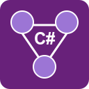
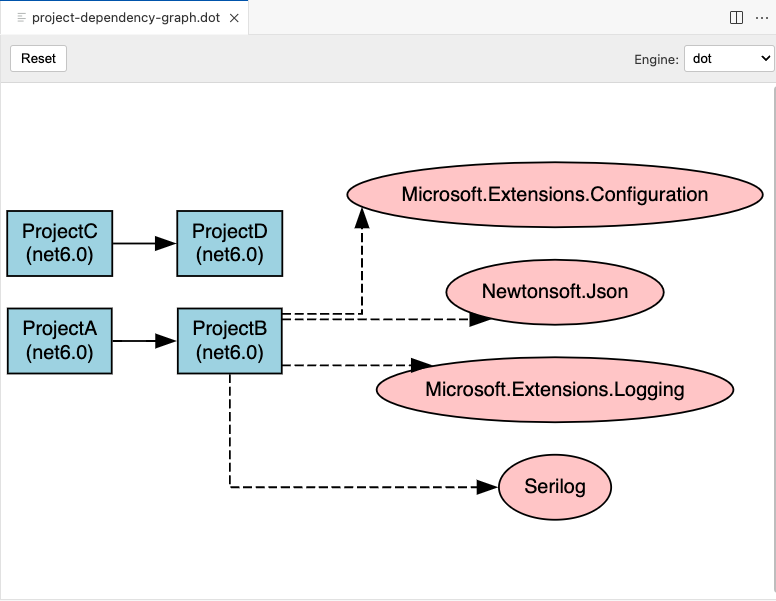
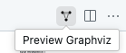
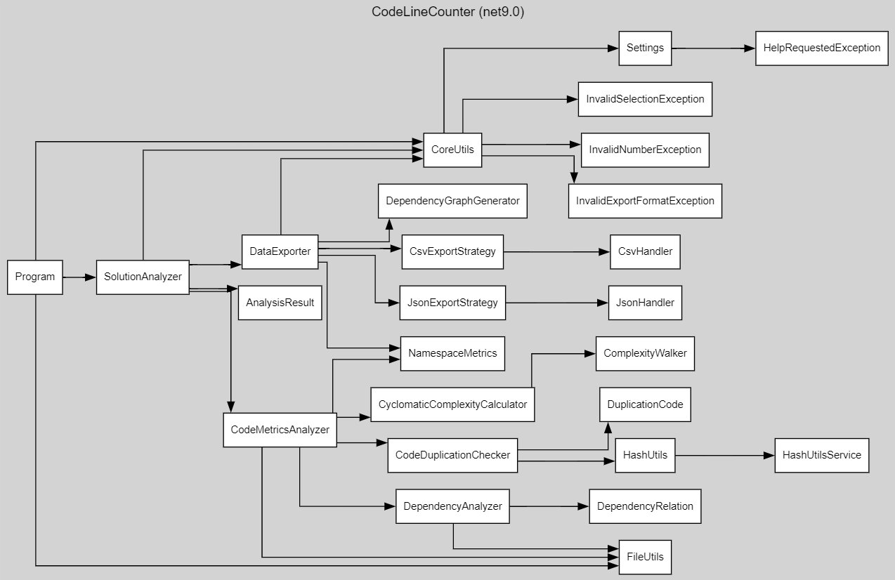
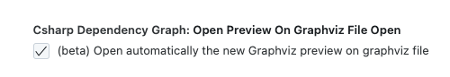
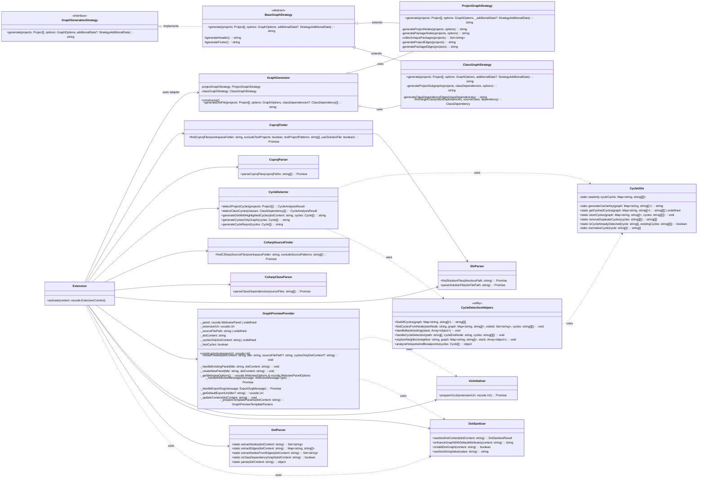

# C# Dependency Graph

<p align="center">
  
</p>

Generate interactive dependency graphs for C# projects and classes directly from Visual Studio Code.

## Recent Changes

- **Enhanced Package Optimization**: Fixed duplicate files in the VSIX package, significantly reducing its size
- **Improved Resource Loading**: Added robust resource loading that works in both development and production environments
- **Fixed Webview Initialization**: Resolved "Required script URIs are not defined" error in the Graphviz preview
- **Added New NPM Scripts**: Simplified packaging process with optimized scripts for building and packaging
- **SVG Export Enhancement**: Improved SVG export functionality from the graph preview
- **Cycle Detection Improvements**: Enhanced cycle detection algorithm for better performance and accuracy
- **Fixed Extension Activation**: Resolved "command already exists" error during debugging with robust command registration

## Change Log

See [CHANGELOG.md](./CHANGELOG.md) for a list of changes in README.md

## Features

- **Project-level dependency visualization**: See how your C# projects depend on each other
- **Class-level dependency analysis**: Analyze dependencies between classes across your solution
- **Solution file support**: Automatically detect and use .sln files to find all projects in a solution structure
- **Customizable output**: Configure which elements to include in your dependency graph
- **Exclude test projects**: Option to exclude test projects from the analysis
- **DOT file output**: Generate standard DOT files for use with internal preview feature or other visualization tools like Graphviz
- **Preview Graphviz**: Preview Graphviz on graphviz file open (beta)
- **Highlight dependencies**: Highlight dependencies in the preview graph (beta)
- **Customizable colors**: Customize the colors of classes and packages in the graph
- **Preview configuration options**: Preview configuration options in settings
- **Export graph as SVG**: Export the generated graph as an SVG file for easy sharing and embedding
- **Cycle detection**: Detect cycles in project and class dependencies
- **Cycle report generation**: Generate a report of cycles in dependencies
- **Cycle analysis**: Analyze hotspots and breakpoints in cycles

## Screenshots

### Project Dependencies


Select view->Command Palette: `C#: Generate Dependency Graph` and select `Project Dependencies`
Graph is generated in  the selected folder. You can open it in Graphviz, Graphviz Online or Graphviz Preview

### Class Dependencies

Select view->Command Palette: `C#: Generate Dependency Graph` and select `Class Dependencies`
Graph is generated in  the selected folder. You can open it in Graphviz, Graphviz Online or Graphviz Preview


## Installation

### From VS Code Marketplace

1. Open VS Code
2. Go to Extensions (Ctrl+Shift+X)
3. Search for "C# Dependency Graph"
4. Click Install

### Manual Installation

1. Download the .vsix file from the [releases page](https://github.com/magic5644/vscode-csharp-dependency-graph/releases)
2. In VS Code, go to Extensions (Ctrl+Shift+X)
3. Click on the "..." menu (top-right) and select "Install from VSIX..."
4. Select the downloaded .vsix file

## Requirements

- Visual Studio Code 1.75.0 or higher
- A C# project (typically a .NET solution with .csproj files)

## Usage

### Generating a Dependency Graph

1. Open a folder containing C# projects in VS Code
2. Press `Ctrl+Shift+P` to open the command palette
3. Type "C#: Generate Dependency Graph" and select the command
4. If solution (.sln) files are found, you'll be asked if you want to use one of them
5. Choose the type of dependency graph:
   - **Project Dependencies**: Shows relationships between projects
   - **Class Dependencies**: Shows detailed relationships between classes
6. Select where to save the .dot file
7. The graph will be generated and saved to the specified location

### Viewing the Graph



You can view the generated .dot file using:

- **New**: Preview Graphviz on graphviz file open (beta) 
- VS Code extensions like [Graphviz Preview](https://marketplace.visualstudio.com/items?itemName=EFanZh.graphviz-preview)
- Online tools like [Graphviz Online](https://dreampuf.github.io/GraphvizOnline/)
- Desktop applications like [Graphviz](https://graphviz.org/)

### Example Class Dependency Graph

Here's an example of a class dependency graph generated by the extension:



### Detailed Usage Examples

#### Example 1: Generating a Project Dependency Graph

1. Open a folder containing multiple C# projects in VS Code.
2. Press `Ctrl+Shift+P` to open the command palette.
3. Type "C#: Generate Dependency Graph" and select the command.
4. If solution (.sln) files are found, you'll be asked if you want to use one of them. Select a solution file or choose to scan for all projects.
5. Choose "Project Dependencies" when prompted for the type of dependency graph.
6. Select a location to save the .dot file.
7. The graph will be generated and saved to the specified location. You can open it using Graphviz or the Graphviz Preview extension.

#### Example 2: Generating a Class Dependency Graph

1. Open a folder containing a C# project in VS Code.
2. Press `Ctrl+Shift+P` to open the command palette.
3. Type "C#: Generate Dependency Graph" and select the command.
4. If solution (.sln) files are found, you'll be asked if you want to use one of them. Select a solution file or choose to scan for all projects.
5. Choose "Class Dependencies" when prompted for the type of dependency graph.
6. Select a location to save the .dot file.
7. The graph will be generated and saved to the specified location. You can open it using Graphviz or the Graphviz Preview extension.

## Extension Settings

This extension contributes the following settings:

- `csharpDependencyGraph.useSolutionFile`: Enable or disable using .sln files to identify projects (default: true)
- `csharpDependencyGraph.includeNetVersion`: Include .NET framework version in project nodes (default: true)
- `csharpDependencyGraph.includePackageDependenciesInProjectGraph`: Include NuGet package dependencies in the project dependency graph (default: false)
- `csharpDependencyGraph.classDependencyColor`: Color for the classes in class dependency graph (default: lightgray)
- `csharpDependencyGraph.packageDependencyColor`: Color for the packages in project dependency graph (default: #ffcccc)
- `csharpDependencyGraph.excludeTestProjects`: Exclude test projects from the dependency graph (default: true)
- `csharpDependencyGraph.testProjectPatterns`: Glob patterns to identify test projects
- `csharpDependencyGraph.excludeSourcePatterns`: Glob patterns for source files to exclude from analysis
- `csharpDependencyGraph.openPreviewOnGraphvizFileOpen`: Enable or disable previewing Graphviz on graphviz file open (default: true)


## How It Works

The extension works by:

1. Finding and parsing .sln files (if enabled) or searching for all .csproj files in the workspace
2. Parsing the project files to extract project references
3. For class-level analysis, parsing all C# files to extract class dependencies including:
   - Inheritance relationships
   - Field and property types
   - Method parameter and return types
   - Static method calls
   - Object instantiations
4. Generating a DOT file representation of the dependency graph
5. Analyzing cycles in dependencies
6. Generating a report of cycles in dependencies

## Code organization



## Known Issues

- Very large codebases with many classes may generate complex graphs that are difficult to render
- Some complex C# syntax constructs might not be correctly parsed for class dependencies
- The extension currently only analyzes direct project references in .csproj files, not transitive package references

### Common Development Issues

#### Issue: "Command already exists" error during debugging

- **Solution**: The extension now includes robust error handling for command registration that gracefully handles duplicate registrations during development
- **Details**: See [DEBUGGING.md](./DEBUGGING.md) for comprehensive debugging guide and best practices

### Troubleshooting Tips

#### Issue: Graph is not rendering correctly

- **Solution**: Ensure that the .dot file is correctly formatted. You can use online tools like [Graphviz Online](https://dreampuf.github.io/GraphvizOnline/) to validate the DOT file.

#### Issue: No .csproj files found

- **Solution**: Make sure that your workspace contains .csproj files. If you are using a solution file, ensure that it references the correct projects.

#### Issue: Class dependencies are not detected

- **Solution**: Ensure that the source files are not excluded by the `excludeSourcePatterns` setting. Also, make sure that the C# files are correctly parsed and contain valid class definitions.

## Contributing

Contributions are welcome! Please feel free to submit a Pull Request.

## Development Guide

### Prerequisites

- [Node.js](https://nodejs.org/) (v14 or higher)
- [npm](https://www.npmjs.com/) (usually comes with Node.js)
- [Visual Studio Code](https://code.visualstudio.com/)
- [TypeScript](https://www.typescriptlang.org/) (v4.0 or higher)

### Setting Up the Development Environment

1. Clone the repository:

   ```bash
   git clone https://github.com/magic5644/vscode-csharp-dependency-graph.git
   cd vscode-csharp-dependency-graph
   ```

2. Install dependencies:

   ```bash
   npm install
   ```

### Building the Extension

To build the extension, run:

```bash
npm run compile
```

For continuous compilation during development:

```bash
npm run watch
```

### Running the Extension

1. Open the project in Visual Studio Code:

   ```bash
   code .
   ```

2. Press `F5` to start debugging. This will launch a new VS Code window with the extension loaded.

3. In the new window, open a folder containing C# projects to test the extension.

### Running Tests

To compile and run the tests:

```bash
npm run test-compile
npm test
```

### Packaging the Extension

To create a VSIX package that can be installed in VS Code:

```bash
npm run package:vsix
```

This command performs a clean build and then packages the extension, ensuring the VSIX file is optimized without duplicate files. The output VSIX file will be created in the root directory of the project.

If you want to check the contents of the VSIX package before distribution, you can run:

```bash
npx vsce ls --tree vscode-csharp-dependency-graph-*.vsix
```

This will display the file structure inside the package, helping you verify that no unnecessary or duplicate files are included.

### Debugging Common Issues

#### Webview Loading Issues

If you encounter issues with the webview not loading correctly (e.g., "Required script URIs are not defined" error), check that:

1. The script URIs are correctly passed to the webview
2. The required JavaScript files exist in the correct location
3. The extension can locate resources in both development and production modes

#### Resource Path Issues

The extension is designed to work with resources in both development mode (`resources/` folder) and production mode (`dist/resources/` folder). If you encounter issues with missing resources:

1. Check the console logs for resource verification results
2. Ensure the build process correctly copies resources to the `dist/` folder
3. Verify the resource loading logic in `graphPreview.ts`

### Coding Guidelines

- Follow the TypeScript style guide
- Write clear and concise code comments
- Include unit tests for new functionality
- Update the README.md if you add new features or settings
- Ensure resources work in both development and production environments

### Submitting a Pull Request

1. Create a new branch for your changes
2. Make your changes and commit them
3. Push your branch to GitHub
4. Create a Pull Request against the main branch
5. Ensure all tests pass
6. Wait for review and address any feedback

## License

This extension is licensed under the [MIT License](LICENSE).
